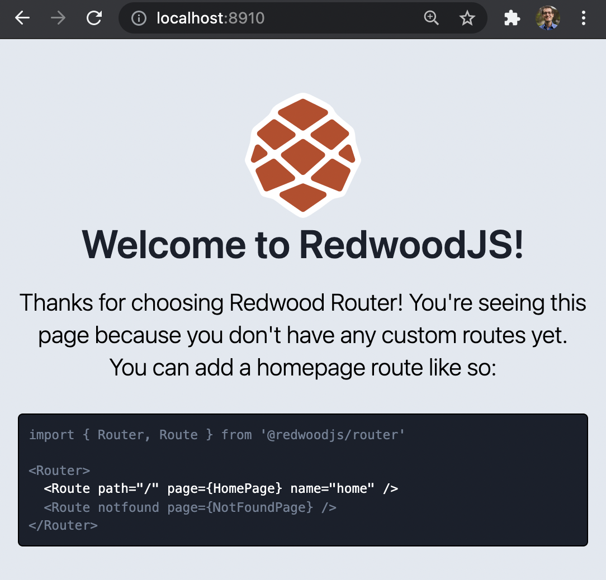
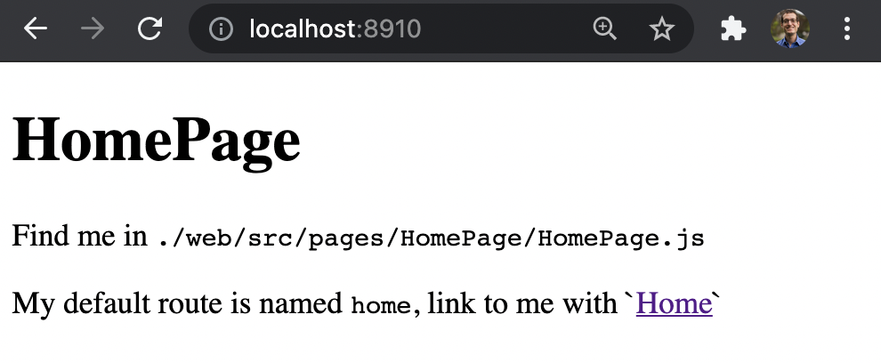
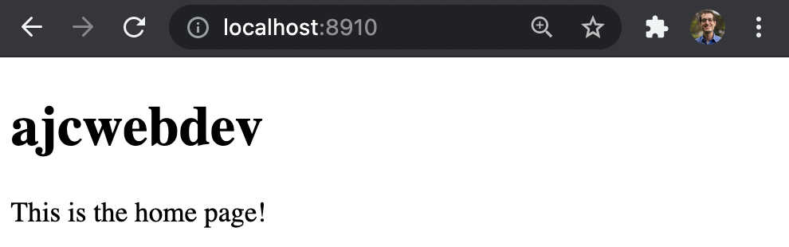
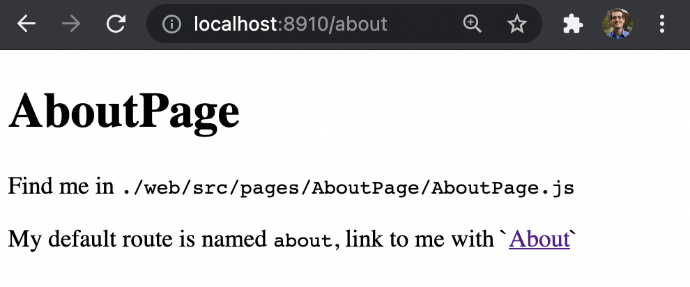
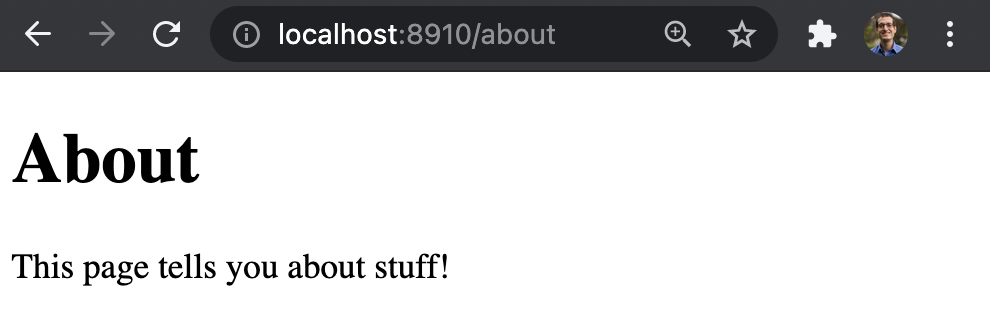
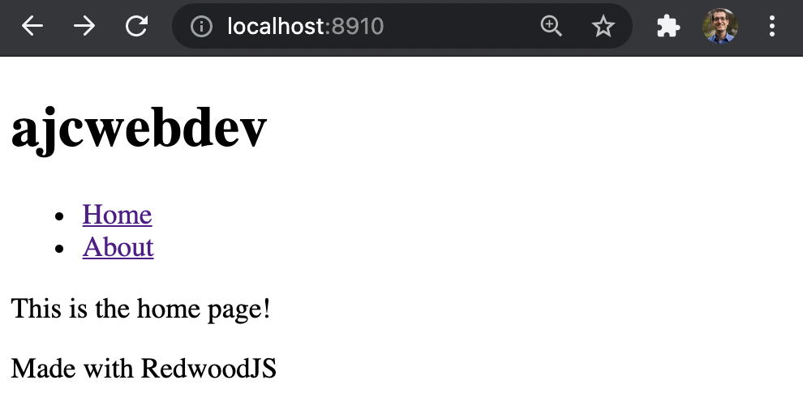
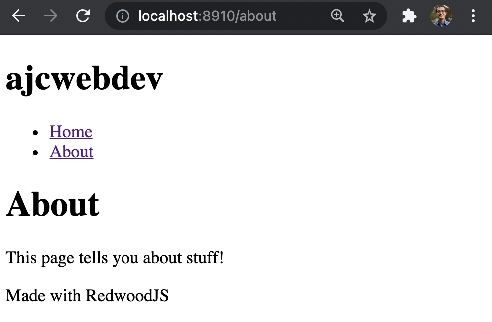

# Chapter 2 - Working on the Web Side

## 1. Prerequisites to environment setup

### Install the necessary dependencies to setup development environment

## 2. Using the Redwood CLI

### Use the basic Redwood commands to get system info, check version number, and get help on other commands

```bash
yarn create redwood-app getting-started-with-redwoodJS
```

```
yarn create v1.22.10
[1/4] 🔍  Resolving packages...
[2/4] 🚚  Fetching packages...
[3/4] 🔗  Linking dependencies...
[4/4] 🔨  Building fresh packages...
success Installed "create-redwood-app@0.32.2" with binaries:
      - create-redwood-app
  ✔ Creating Redwood app
    ✔ Creating directory '/Users/ajcwebdev/getting-started-with-redwoodJS'
  ✔ Installing packages
    ✔ Checking node and yarn compatibility
    ✔ Running 'yarn install'... (This could take a while)
  ✔ Convert TypeScript files to JavaScript

Thanks for trying out Redwood!

 ⚡️ Get up and running fast with this Quick Start guide: https://redwoodjs.com/docs/quick-start

Join the Community

 ❖ Join our Forums: https://community.redwoodjs.com
 ❖ Join our Chat: https://discord.gg/redwoodjs

Get some help

 ❖ Get started with the Tutorial: https://redwoodjs.com/tutorial
 ❖ Read the Documentation: https://redwoodjs.com/docs

Stay updated

 ❖ Sign up for our Newsletter: https://www.redwoodjs.com/newsletter
 ❖ Follow us on Twitter: https://twitter.com/redwoodjs

Become a Contributor ❤

 ❖ Learn how to get started: https://redwoodjs.com/docs/contributing
 ❖ Find a Good First Issue: https://redwoodjs.com/good-first-issue

Fire it up! 🚀

 > cd getting-started-with-redwoodJS
 > yarn rw dev
```

```bash
cd getting-started-with-redwoodJS
yarn rw dev
```



```bash
yarn rw info
```

```
System:
  OS: macOS 11.3
  Shell: 5.8 - /bin/zsh
Binaries:
  Node: 14.17.0 - /var/folders/4r/lcm_4z051cdg60f0v15vwljr0000gn/T/yarn--1622601310784-0.6162156541946524/node
  Yarn: 1.22.10 - /var/folders/4r/lcm_4z051cdg60f0v15vwljr0000gn/T/yarn--1622601310784-0.6162156541946524/yarn
Databases:
  SQLite: 3.32.3 - /usr/bin/sqlite3
Browsers:
  Chrome: 91.0.4472.77
  Firefox: 87.0
  Safari: 14.1
npmPackages:
  @redwoodjs/core: ^0.32.2 => 0.32.2 
```

```bash
yarn rw --version
```

```
0.32.2
```

```bash
yarn rw help
```

```
rw <command>

Commands:
  rw build [side..]         Build for production
  rw check                  Get structural diagnostics for a Redwood project
                            (experimental)                [aliases: diagnostics]
  rw console                Launch an interactive Redwood shell (experimental)
                                                                    [aliases: c]
  rw dataMigrate <command>  Migrate the data in your database      [aliases: dm]
  rw deploy <target>        Deploy your Redwood project
  rw destroy <type>         Rollback changes made by the generate command
                                                                    [aliases: d]
  rw dev [side..]           Start development servers for api, and web
  rw generate <type>        Save time by generating boilerplate code[aliases: g]
  rw info                   Print your system environment information
  rw lint                   Lint your files
  rw open                   Open your project in your browser
  rw prerender              Prerender pages of a redwood app (experimental)
                                                               [aliases: render]
  rw prisma [commands..]    Run Prisma CLI with experimental features
  rw serve [side]           Run server for api or web in production
  rw setup <commmand>       Initialize project config and install packages
  rw storybook              Launch Storybook: An isolated component development
                            environment                            [aliases: sb]
  rw test [side..]          Run Jest tests. Defaults to watch mode
  rw ts-to-js               Convert a TypeScript project to JavaScript
  rw upgrade                Upgrade all @redwoodjs packages via interactive CLI

Options:
  --help     Show help                                                 [boolean]
  --version  Show version number                                       [boolean]

Examples:
  yarn rw g page home /  "Create a page component named 'Home' at path '/'"
```

## 3. Generate Pages

### Create pages with routes automatically configured

```bash
yarn rw g page home /
```

```
✔ Generating page files...
  ✔ Successfully wrote file `./web/src/pages/HomePage/HomePage.stories.js`
  ✔ Successfully wrote file `./web/src/pages/HomePage/HomePage.test.js`
  ✔ Successfully wrote file `./web/src/pages/HomePage/HomePage.js`
✔ Updating routes file...
```



```jsx
// web/src/pages/HomePage/HomePage.js

import { Link, routes } from '@redwoodjs/router'

const HomePage = () => {
  return (
    <>
      <h1>HomePage</h1>
      <p>
        Find me in <code>./web/src/pages/HomePage/HomePage.js</code>
      </p>
      <p>
        My default route is named <code>home</code>, link to me with `
        <Link to={routes.home()}>Home</Link>`
      </p>
    </>
  )
}

export default HomePage
```

```jsx
// web/src/pages/HomePage/HomePage.js

const HomePage = () => {
  return (
    <>
      <h1>ajcwebdev</h1>
      <p>This is the home page!</p>
    </>
  )
}

export default HomePage
```



```bash
yarn rw g page about
```

```
✔ Generating page files...
  ✔ Successfully wrote file `./web/src/pages/AboutPage/AboutPage.stories.js`
  ✔ Successfully wrote file `./web/src/pages/AboutPage/AboutPage.test.js`
  ✔ Successfully wrote file `./web/src/pages/AboutPage/AboutPage.js`
```



```jsx
// web/src/pages/AboutPage/AboutPage.js

import { Link, routes } from '@redwoodjs/router'

const AboutPage = () => {
  return (
    <>
      <h1>AboutPage</h1>
      <p>
        Find me in <code>./web/src/pages/AboutPage/AboutPage.js</code>
      </p>
      <p>
        My default route is named <code>about</code>, link to me with `
        <Link to={routes.about()}>About</Link>`
      </p>
    </>
  )
}

export default AboutPage
```

```jsx
// web/src/pages/AboutPage/AboutPage.js

const AboutPage = () => {
  return (
    <>
      <h1>About</h1>
      <p>This page tells you about stuff!</p>
    </>
  )
}

export default AboutPage
```



## 4. Modifying Routes

### Modify routes to change paths

```jsx
import { Router, Route } from '@redwoodjs/router'

const Routes = () => {
  return (
    <Router>
      <Route path="/about" page={AboutPage} name="about" />
      <Route path="/" page={HomePage} name="home" />
      <Route notfound page={NotFoundPage} />
    </Router>
  )
}

export default Routes
```

## 5. Creating Layouts

### Create a layout for a navigation bar

```bash
yarn rw g layout home
```

```
✔ Generating layout files...
  ✔ Successfully wrote file `./web/src/layouts/HomeLayout/HomeLayout.test.js`
  ✔ Successfully wrote file `./web/src/layouts/HomeLayout/HomeLayout.stories.js`
  ✔ Successfully wrote file `./web/src/layouts/HomeLayout/HomeLayout.js`
```

```jsx
const HomeLayout = ({ children }) => {
  return <>{children}</>
}

export default HomeLayout
```

```jsx
import { Link, routes } from '@redwoodjs/router'

const HomeLayout = ({ children }) => {
  return (
    <>
      <header>
        <h1>ajcwebdev</h1>
        
        <nav>
          <ul>
            <li>
              <Link to={routes.home()}>Home</Link>
            </li>
            <li>
              <Link to={routes.about()}>About</Link>
            </li>
          </ul>
        </nav>
      </header>

      <main>{children}</main>

      <footer>Made with RedwoodJS</footer>
    </>
  )
}

export default HomeLayout
```

```jsx
// web/src/pages/HomePage/HomePage.js

import HomeLayout from 'web/src/layouts/HomeLayout/HomeLayout'

const HomePage = () => {
  return (
    <HomeLayout>
      <p>This is the home page!</p>
    </HomeLayout>
  )
}

export default HomePage
```



```jsx
// web/src/pages/AboutPage/AboutPage.js

import HomeLayout from 'web/src/layouts/HomeLayout/HomeLayout'

const AboutPage = () => {
  return (
    <HomeLayout>
      <h1>About</h1>
      <p>This page tells you about stuff!</p>
    </HomeLayout>
  )
}

export default AboutPage
```

